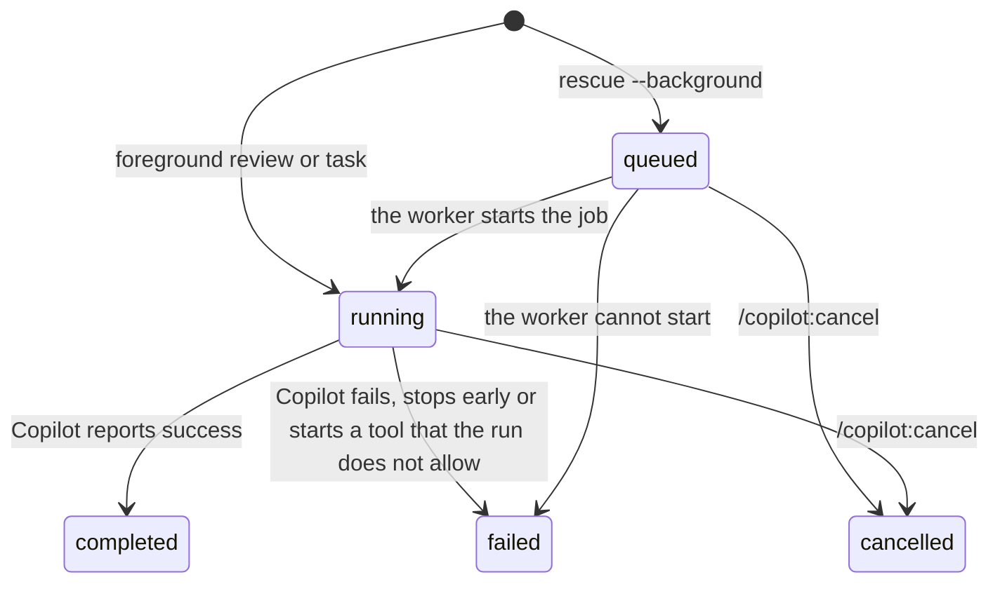

# Operations

How to look after the plugin's jobs: their states, their files, cancel, clean-up and resume. The
folders are listed in [configuration.md](configuration.md#folders).

## Job states

Each review and each task is a job. `/copilot:status` shows the jobs of the current Claude session.

- A background task is written as `queued` before its worker starts. The worker then marks it
  `running`.
- A job that is cancelled, or whose Claude session has ended, never starts again.

## Logs and state

Each workspace has one folder in the state folder. In it:

- `state.json` lists the jobs.
- `jobs/<job id>.json` is the full record of a job, with its result.
- `jobs/<job id>.log` is the progress log of a job.

`/copilot:status <job id>` shows the last lines of the log. `/copilot:result <job id>` shows the
stored result. The plugin keeps all queued and running jobs and the 50 newest finished jobs. It
deletes the files of older jobs.

## Cancel

Run `/copilot:cancel <job id>`. Without a job id, the command cancels the only active job of the
current session.

Cancel first marks the job `cancelled`. Then it stops the job's companion process and the Copilot
process, with the children of each. A process that does not stop in 5 seconds is killed. On macOS
and Linux, a program that a `--write` task detaches on purpose (for example with `setsid`) is not
stopped.

## Clean up

- Finished jobs are removed by the plugin, as above. You do not need to delete them.
- Copilot keeps a session for every review and every task. Reviews and read-only tasks keep their
  sessions in the plugin's own Copilot folder (`copilot-home`). When no job runs, you can delete
  that whole folder. It holds no login: Copilot reads the login from the credential store, the
  GitHub CLI or a token variable.
- Tasks with `--write` keep their sessions in your own Copilot folder (`~/.copilot`), with your
  other Copilot sessions.

## Resume a task

- In Claude Code, `/copilot:rescue --resume` continues the latest task of the same mode. A
  read-only task continues only a read-only task, and a `--write` task only a `--write` task. Use
  `--fresh` to start a new task instead.
- A `--write` task runs with your own Copilot folder. `/copilot:result` shows a
  `copilot --resume=<session id>` command. Run it in a terminal to continue the session in the
  Copilot CLI.
- A read-only job shows only its session id, with no command.

**Warning:** never start Copilot by hand with `COPILOT_HOME` set to the plugin's Copilot folder. An
interactive Copilot asks whether to trust the working folder. The plugin's folder stays safe only
because nobody ever answers that question in it. Once a folder is trusted there, reviews and
read-only tasks could start that repository's hooks and MCP servers. Copilot does not document where
it keeps this answer, so the plugin cannot check for it.
