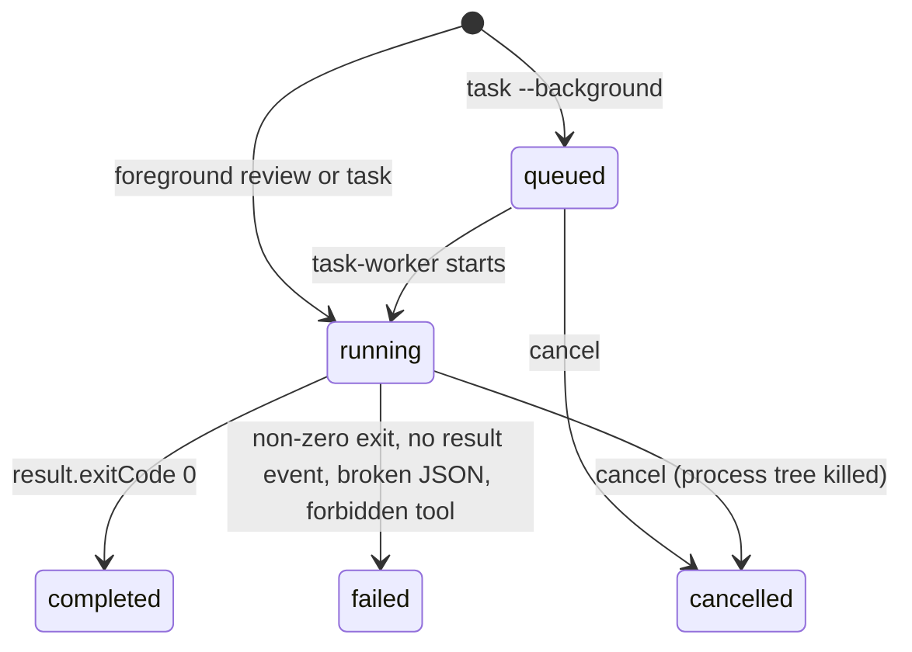

# Data model: Copilot plugin port

The records keep upstream's shape (`scripts/lib/state.mjs`, `scripts/lib/tracked-jobs.mjs`), so that
upstream changes to them port cleanly. Only the meaning of some fields changes, as noted.

## Workspace state (`state.json`)

One file per workspace, at `<state root>/<slug>-<hash>/state.json`.

- `<state root>` is `$CLAUDE_PLUGIN_DATA/state`, or `<tmp>/copilot-companion` without it.
- `<slug>` is the workspace folder name with unsafe characters replaced.
- `<hash>` is the first 16 hex characters of the SHA-256 of the real workspace path.

| Field | Type | Notes |
| --- | --- | --- |
| `version` | number | `1` |
| `config.stopReviewGate` | boolean | Default `false`. Set by `setup --enable-review-gate` or `--disable-review-gate` |
| `jobs` | Job summary[] | Newest first. All queued and running jobs, plus at most 50 finished jobs. Pruning deletes the pruned jobs' files and logs |
| `closedSessions` | `{ id, closedAt }[]` | Claude session ids that `SessionEnd` has closed; no job is created, claimed or started for them. Kept for 30 days, with no count cap; a companion paused for longer than that is not covered (research §7, hook time budgets) |

Every update holds the lock file `state.json.lock` and replaces `state.json` through a temp file
and a rename (research §7, locked state updates).

## Job

A summary lives in `state.json`. The full record lives in `jobs/<id>.json`, and the log in
`jobs/<id>.log`.

| Field | Type | Notes |
| --- | --- | --- |
| `id` | string | `<prefix>-<base36 time>-<random>`; prefix `review` or `task` |
| `kind` | string | `review`, `adversarial-review` or `task` |
| `kindLabel` | string | `review`, `adversarial-review` or `rescue` |
| `jobClass` | string | `review` or `task` |
| `title`, `summary` | string | "Copilot Review", "Copilot Task", "Copilot Stop Gate Review", and so on |
| `workspaceRoot` | string | Git top level, or the cwd outside git |
| `sessionId` | string | Claude session id from `COPILOT_COMPANION_SESSION_ID`, when set |
| `status` | string | See the state flow below |
| `phase` | string | `queued`, `starting`, `reviewing`, `investigating`, `running`, `verifying`, `editing`, `finalizing`, `done`, `failed`, `cancelled` |
| `threadId` | string or null | **Copilot session id**, set with `--session-id` before the run starts (upstream: Codex thread id) |
| `turnId` | string or null | **`turnId` of the last `assistant.turn_start` event** (upstream: Codex turn id) |
| `pid` | number or null | The process to kill on cancel: the worker for background jobs, the companion for foreground jobs |
| `copilotPid` | number or null | The Copilot child's process id while a run is active; cancel stops its group too (research §7) |
| `write` | boolean | `true` only for `task --write` |
| `logFile` | string | Path of `jobs/<id>.log` |
| `request` | object | Background tasks only: the stored task request for `task-worker` |
| `createdAt`, `startedAt`, `updatedAt`, `completedAt`, `cancelledAt` | ISO string | |
| `errorMessage` | string | On failure or cancel |
| `result` | object | Full record only: the command payload (see below) |
| `rendered` | string | Full record only: the text the command printed |

State flow:

## Payloads in `result`

- **Native review** (`review`): `review`, `target`, `threadId`, `sourceThreadId` (same as
  `threadId`; Copilot has no separate review thread), and `copilot` with `status`, `stderr`, `stdout`
  (the review text) and `reasoning`.
- **Adversarial review**: as upstream, with `copilot` in place of `codex`, plus `result` (parsed JSON
  that matches `schemas/review-output.schema.json`), `rawOutput` and `parseError`.
- **Task**: `status`, `threadId`, `rawOutput`, `touchedFiles` (`usage.codeChanges.filesModified` from
  the `result` event) and `reasoningSummary`.

## Permission profile

Not stored. The adapter builds it for each run from the job's `write` value:

- `read-only`: `review`, `adversarial-review`, the review gate, and `task` without `--write`.
- `write`: `task --write`.

The Copilot arguments and environment of each profile are listed in research.md §3 only.
